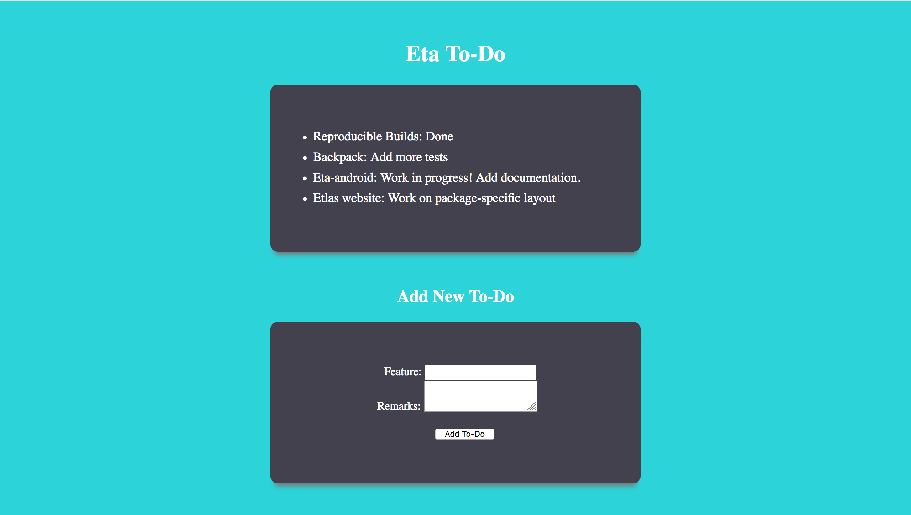

<h1 align="center">Eta To-do</h1>

<p align="center">
  
</p>

## Running the web application

A simple to-do web application in Eta using Spock web framework and Lucid DSL. Follow the below steps to play with the application.

1) Fire up the terminal and enter the commands:

  ```
  $ git clone https://github.com/Jyothsnasrinivas/eta-todo.git
  $ cd eta-spock-example
  $ etlas run
  ```

2) Open the url `http://localhost:8080` in your favourite browser.


3) To play around with it, add a note in the form.
